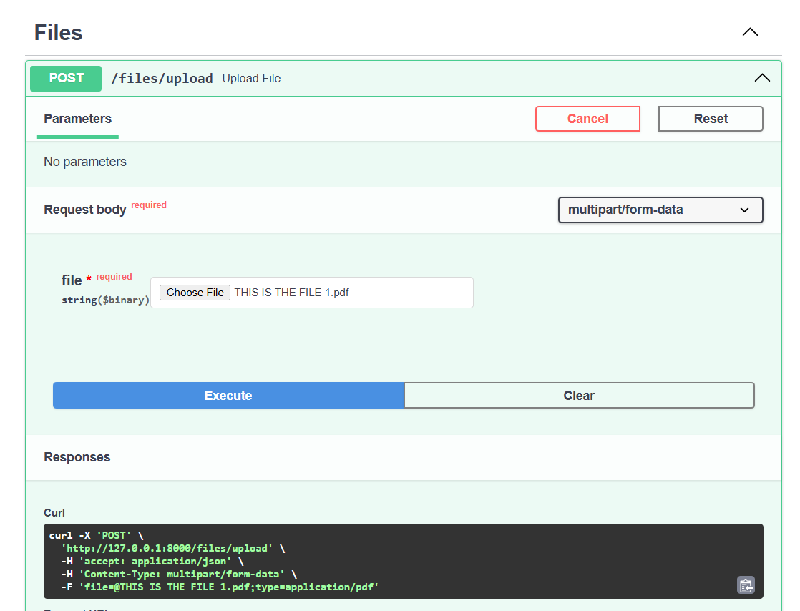
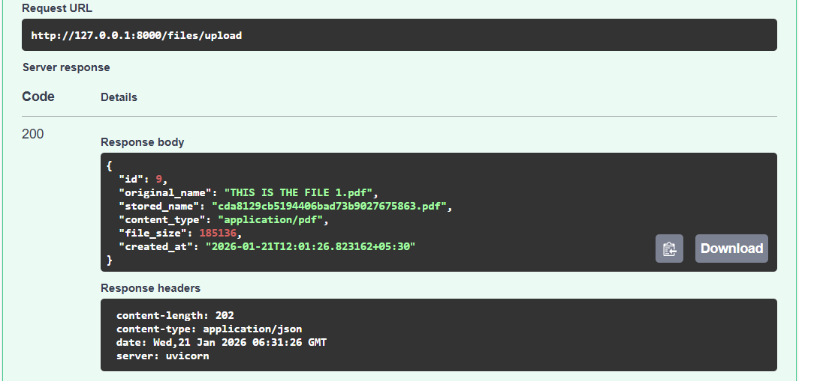
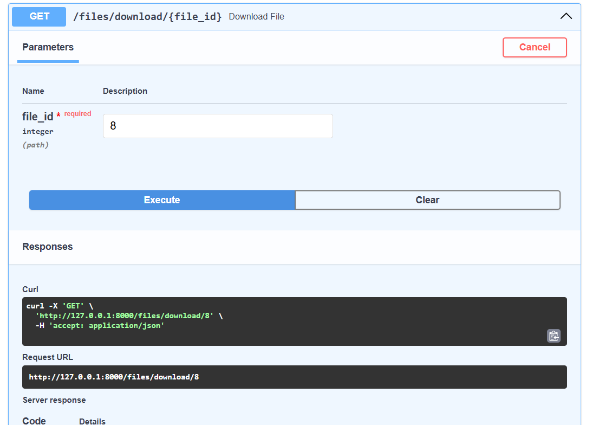
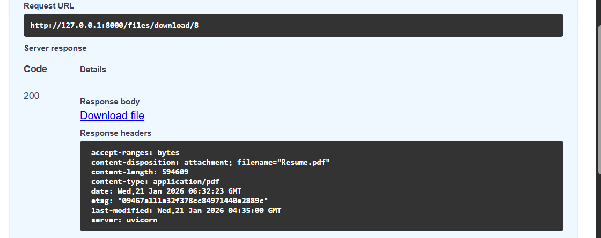

# FastAPI File Upload Backend

A backend project built with **FastAPI** that demonstrates how to design and implement a **File handling system**.
---
## What this project does

- Accepts file uploads using `multipart/form-data`
- Validates uploaded files (type and size)
- Stores files safely on disk with unique filenames
- Saves file metadata in a PostgreSQL database
- Allows downloading files via API endpoints
---

## Below are the screenshots of the api working in SwaggerUI

## 🛠️ Tech Stack

- FastAPI
- Python
- PostgreSQL
- SQLAlchemy
- Uvicorn

---